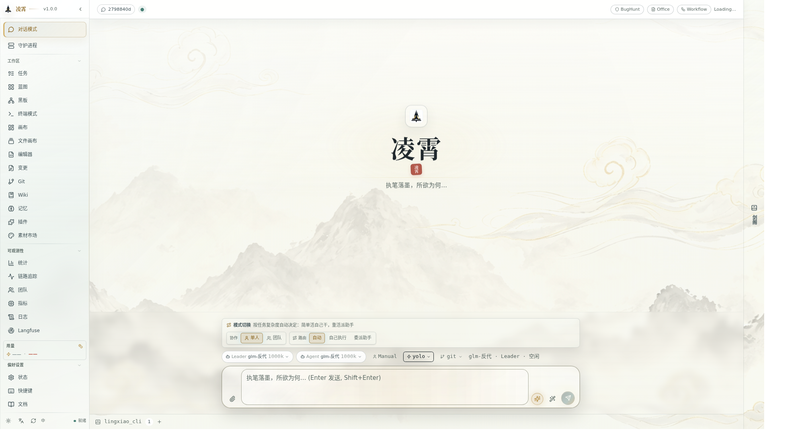
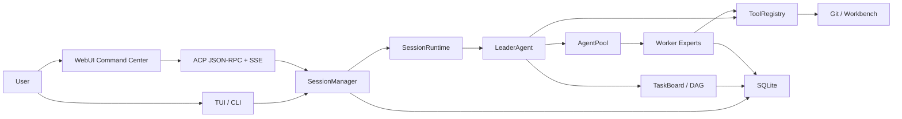

# LingXiao 剑域

<p align="center">
  
</p>

<p align="center">
  <strong>One sword cleaves the sky. Build what you envision.</strong>
</p>

<p align="center">
  
</p>

<p align="center"><sub>LingXiao WebUI — Tasks · Blackboard · Terminal · Git · Agents · Memory · Plugins</sub></p>

---

> You give a goal. The Leader decomposes, plans, builds a DAG, assembles experts, dispatches, supervises, and delivers. Worker experts execute research, frontend, backend, testing, review, documentation, and Git in parallel. WebUI / TUI / backend share the same runtime state — observable, recoverable, auditable.

`v1.0.0` · Node.js 24+ · Linux / macOS / Windows

[中文 README](./README.zh-CN.md) · [Bilingual](./README.md) · [Docs](https://hexian2001.github.io/lingxiao_website/)

---

## Table of Contents

- [What It Is](#what-it-is)
- [Install](#install)
- [Quick Start](#quick-start)
- [Core Features](#core-features)
  - [Expert Team Runtime](#expert-team-runtime)
  - [Task DAG Orchestration](#task-dag-orchestration)
  - [Unified Runtime-State Sync](#unified-runtime-state-sync)
  - [WebUI Command Center](#webui-command-center)
  - [Real Tool Kernel](#real-tool-kernel)
  - [Orchestration & Verification](#orchestration--verification)
  - [MCP Forge & Skills](#mcp-forge--skills)
  - [Persistent Memory](#persistent-memory)
  - [Eternal Autonomous Mode](#eternal-autonomous-mode)
  - [Local LLM Gateway](#local-llm-gateway)
- [Architecture](#architecture)
- [Configuration](#configuration)
- [Development](#development)
- [Security](#security)
- [Tech Stack](#tech-stack)
- [License](#license)

---

## What It Is

LingXiao turns "chatting with a model" into "commanding an AI expert team."

| Traditional Chat | LingXiao |
|:---|:---|
| Single assistant, single thread | Leader + Worker expert team |
| Flat conversation history | Dependency-aware task DAG |
| No real tool execution | File I/O, shell, Git, browser, terminal, MCP |
| State lost on refresh | SQLite-backed, recoverable sessions |
| Black-box decisions | Full audit trail: tasks, tools, evidence, verdicts |
| No parallelism | Independent tasks dispatched in parallel |

You state a goal. The Leader understands it, decomposes it into a task graph, assembles the right expert workers, dispatches work, supervises progress, and closes the loop with evidence. Every Worker has independent identity, context, toolchain, and runtime state — not UI decoration, but real execution entities in the scheduling model.

---

## Install

### Option 1: One-Line Install (Recommended)

**macOS / Linux / WSL:**

```bash
curl -fsSL https://raw.githubusercontent.com/hexian2001/lingxiao-coding/main/scripts/install.sh | sh
```

**Windows (CMD / PowerShell):**

```powershell
powershell -c "irm https://raw.githubusercontent.com/hexian2001/lingxiao-coding/main/scripts/install.ps1 | iex"
```

> ℹ️ No Node.js required. The script auto-detects platform and architecture, downloads the matching portable binary, and installs it to `~/.lingxiao/bin`.

### Option 2: Build from Source

```bash
git clone https://github.com/hexian2001/lingxiao-coding.git
cd lingxiao-coding
npm install
npm run build
npm link
```

### Upgrade

```bash
lingxiao upgrade          # Check and upgrade to latest
lingxiao upgrade --check  # Check only, no upgrade
```

### First-Time Setup

```bash
lingxiao init       # Initialize config at ~/.lingxiao/settings.json
lingxiao doctor     # Environment diagnostics
```

---

## Quick Start

```bash
lingxiao                          # Start TUI + WebUI
lingxiao --session <session_id>   # Resume a session
lingxiao list                     # List all sessions
```

The terminal prints the WebUI URL. Port metadata is written to `~/.lingxiao/port`.

<details>
<summary>📋 Typical Workflow</summary>

1. **Start**: Run `lingxiao` — TUI launches, WebUI URL printed.
2. **Give a goal**: Type your engineering goal in chat.
3. **Leader plans**: Leader decomposes into a task DAG, may ask for confirmation.
4. **Workers execute**: Expert workers are dispatched, each with tools and context.
5. **Monitor**: Watch task progress, agent panels, tool calls in real-time.
6. **Review**: Leader presents results with evidence and file changes.
7. **Iterate**: Resume sessions, run `lingxiao upgrade` for updates.

</details>

---

## Core Features

### Expert Team Runtime

LingXiao's basic unit is not "an assistant" — it's a **Leader + Worker expert team**:

| Role | Responsibility |
|:-----|:---------------|
| **Leader** | Goal understanding, task decomposition, DAG planning, expert dispatch, user confirmation, delivery |
| **Architect** | Architecture design, interface boundaries, module splitting, risk control |
| **Backend** | Backend implementation, state machines, APIs, databases, task scheduling |
| **Frontend** | WebUI/TUI interaction, state projection, visualization workbench |
| **Researcher** | Research, comparison, external verification |
| **QA/Reviewer** | Testing, regression, code review, acceptance evidence |
| **Custom** | Extend through role registration, skill system, and tool permissions |

Every Worker has:
- **Identity**: agent ID, role, name, display in WebUI/TUI
- **Ownership**: bound task, write scope, tool permissions
- **Context**: independent conversation history, injected skills, system prompt
- **Runtime state**: running / paused / waiting / completed / failed
- **Audit trail**: tool calls, logs, work notes, completion reports

### Task DAG Orchestration

Complex goals become dependency-aware task graphs:

```text
T-1 Requirements Analysis
  ├─ T-2 Architecture Design
  │    ├─ T-3 Backend Implementation
  │    └─ T-4 Frontend Implementation
  ├─ T-5 Integration Verification
  └─ T-6 Documentation & Release
```

| Feature | Description |
|:--------|:------------|
| Parallel dispatch | Independent tasks run simultaneously (write-scope orthogonal) |
| Dependency ordering | `blocked_by` ensures correct sequencing |
| Evidence preservation | Every task stores results, artifacts, and verification |
| Recovery | Interrupted sessions resume from last state |
| Contract loop | `contract → implement → evaluate → repair → reset` |

### Unified Runtime-State Sync

WebUI, TUI, and backend **do not infer state from event streams**. They share one calibration source:

```text
SessionManager
  → session:runtime_state
  → SseBridge
  → ACP session/update: session_runtime_state
  → Web sessionStore / TUI event bridge
```

The runtime snapshot covers:

- Session status (active / idle / waiting / completed)
- Leader state (busy / waiting / review / asking user)
- Pending user input and permission requests
- Running workers (agent ID, task, progress)
- Dispatchable tasks (ready, blocked, terminal)
- Turn classification (user turn / leader turn / worker turn)

Text streams, thinking, tool-call deltas, and tool results remain fine-grained incremental events. **Snapshots calibrate; streams deliver the live experience.**

### WebUI Command Center

The WebUI is an **Agent Command Center**, not just a chat window:

| Panel | Purpose |
|:------|:--------|
| **Chat** | Main control — thinking, tool calls, streaming output, user interaction |
| **Tasks** | Task DAG visualization — status, dependencies, results, evidence |
| **Agents** | Worker panels — roles, runtime state, task binding, context |
| **Review** | Change evidence — file diffs, acceptance trails, verdict history |
| **Git** | Version control — status, diff, branch, commit, push/pull, stash |
| **Blackboard** | Team memory — facts, intent, graph relationships |
| **Terminal** | In-browser shell — full terminal access from the WebUI |
| **Settings** | Configuration — models, permissions, tools, plugins, modes |

### Real Tool Kernel

LingXiao agents don't just talk. They use **real tools** under permission control:

| Category | Tools |
|:---------|:------|
| File I/O | Read, create, structured patch, directory listing |
| Search | Code search (ripgrep), glob, AST query (TypeScript) |
| Execution | Shell, Python, Node.js REPL, terminal control |
| Version Control | Git workbench — status, diff, commit, branch, push/pull, MR/PR |
| Browser | Navigation, click, fill, screenshot, eval JS, OCR |
| Web | Fetch, search, HTTP request |
| Office | PPTX, DOCX, XLSX, PDF generation and editing |
| Canvas | Workflow canvas, execution engine |
| Team | Messages, work notes, blackboard graph |
| External | Unified MCP entrypoint for external systems |

### Orchestration & Verification

LingXiao doesn't just dispatch tasks — it runs **structured verification** on every completed task:

<details>
<summary>🔧 Verification Subsystems</summary>

| Subsystem | Description |
|:----------|:------------|
| **Orchestration Runtime** | Task lifecycle events auto-trigger verdict extraction (PASS / FAIL / BLOCKED) |
| **Speculative Execution** | Parallel implementation branches with `first_green` / `fewest_changes` / `fastest_tests` selection |
| **Adversarial Verification** | Command-level breaker strategies with exit-code assertions + stdout/stderr evidence |
| **Adaptive Orchestration** | Difficulty-signal-driven routing: cross-module deps, hotspot overlap, prior failures, impact ratio |
| **Contract Loop** | `contract → implement → evaluate → repair → reset` with blackboard materialization |
| **Bug Hunting** | Bughunt DAG scheduler + evidence capture/pack + finding ledger, isolated worktree execution |
| **Assumption Tracking** | Agents declare verifiable assumptions (type_check / file_content / test_execution / ast_query), auto-validated on code changes |

</details>

### MCP Forge & Skills

| System | Description |
|:-------|:------------|
| **MCP Forge** | Template-driven MCP Server generation engine — requirements → template → generate → sandbox → inspect → register |
| **Skills** | 4-tier priority (project > plugin > global > bundled), YAML frontmatter definition, auto-injected into worker prompts by role and task |

### Persistent Memory

Two-layer memory architecture:

| Layer | Description |
|:------|:------------|
| **Long-term** | FTS5 + BM25 full-text search · 4 memory types (user / feedback / project / reference) · auto-distillation · associative recall · maintenance pipeline |
| **Short-term** | Skill injection at worker dispatch — execution knowledge complementing long-term memory |

### Eternal Autonomous Mode

Leader self-patrol state machine:

```text
IDLE → CHECK → PATROL → THINK → WAIT → IDLE
```

- 30s base interval with exponential backoff
- Budget circuit breaker at 8 consecutive failures
- EternalSupervisor: 3-layer health check (PID + watchdog + HTTP) + auto-restart

### Local LLM Gateway

LingXiao can act as an **OpenAI / Anthropic dual-format LLM proxy**:

- Virtual key management
- Per-key RPM / TPM / daily token budget
- Request trace logging
- Default port: `62000`

---

## Architecture



---

## Configuration

Config file: `~/.lingxiao/settings.json`

| Variable | Description | Default |
|:---------|:------------|:--------|
| `LINGXIAO_LLM_PROVIDER` | LLM provider: `auto` / `openai` / `anthropic` | `auto` |
| `LINGXIAO_OPENAI_API_KEY` | OpenAI or compatible API key | — |
| `LINGXIAO_OPENAI_BASE_URL` | OpenAI-compatible endpoint | — |
| `LINGXIAO_ANTHROPIC_API_KEY` | Anthropic API key | — |
| `LINGXIAO_LEADER_MODEL` | Leader model name | — |
| `LINGXIAO_AGENT_MODEL` | Worker model name | — |
| `LINGXIAO_WEB_PORT` | Web server port | `0` (auto) |

> ℹ️ Supports OpenAI, Anthropic, DeepSeek, Qwen, Moonshot/Kimi, Gemini-compatible, Groq, SiliconFlow, and other OpenAI-format services.

---

## Development

```bash
# Install dependencies
npm install

# Build (TypeScript + Web + Server)
npm run build

# Development
npm run cli                    # Run CLI directly
cd web && npm run dev          # Web dev server

# Testing
npm run test:architecture      # Architecture invariant tests
npm run test:scripts           # Script invariant tests
npm test                       # Full test suite

# Type checking
npx tsc -p tsconfig.cli.json --noEmit
npx tsc -p web/tsconfig.json --noEmit
```

<details>
<summary>📚 Documentation Index</summary>

| Document | Description |
|:---------|:------------|
| [Engineering Docs](./docs/README.md) | Engineering documentation index |
| [Architecture](./docs/architecture.md) | System architecture overview |
| [Runtime State Sync](./docs/runtime-state-sync.md) | State synchronization design |
| [ACP Contract](./docs/contracts/acp.md) | Agent Communication Protocol |
| [Session Events](./docs/contracts/session-events.md) | Session event contract |
| [Session State](./docs/contracts/session-state.md) | Session state contract |
| [Agents & Tools](./docs/contracts/agents-tools.md) | Agent and tool contract |
| [Testing](./docs/testing.md) | Testing and quality gates |
| [Release Guide](./docs/repository-release.md) | Repository release process |

</details>

---

## Security

> ⚠️ LingXiao has **real host capabilities**: file read/write, shell execution, browser automation, Git operations, terminal access, workflow execution, external model calls, and worker task execution.

| Rule | Detail |
|:-----|:-------|
| **Token protection** | The Web server token is local machine control. Do not expose an unprotected server. |
| **No secrets in Git** | Never commit `.env`, API keys, Git tokens, SQLite session databases, or token-bearing remote URLs. |
| **Permission modes** | Strict → Dev → Networked → Yolo. Workers operate under the session's permission level. |
| **Sandbox** | Shell commands run in app-guard / bubblewrap sandbox with network isolation options. |

---

## Tech Stack

| Layer | Technology |
|:------|:-----------|
| Runtime | Node.js 24+ · TypeScript · Fastify |
| Storage | SQLite (sessions, tasks, messages, agents, tools, workflows) |
| Web UI | React · Ink (TUI) |
| Browser | Playwright |
| LLM | OpenAI SDK · Anthropic SDK |
| Docs | Astro (Starlight) |

---

## License

AGPL-3.0-only. See [LICENSE](./LICENSE).

---

<div align="center">

**LingXiao** — One Sword Cleaves the Sky

Proprietary software · Unauthorized copying, modification, or distribution prohibited

</div>
