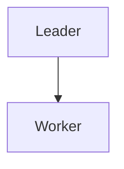
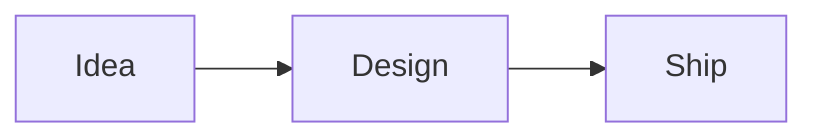

# Slidev Skill

## When to Use

Use `generate_slidev` when the user wants:

- Developer talks, technical sharing, tutorials, courses, architecture walkthroughs
- Markdown-first slide authoring
- Code highlighting, line highlighting, incremental code steps
- Mermaid diagrams
- Browser preview plus export to PDF / PPTX / PNG
- Technical or business decks that benefit from a Web/Markdown workflow

## When Not to Use

| User goal | Use instead |
|---|---|
| Highly custom HTML interaction/animation | `generate_html_presentation` or huashu-design |
| Static long-form document/report | HTML document or PDF |

Important: Slidev exports PPTX as screenshots/images. The exported PPTX is visually useful but text is not editable.

## Tool Choice Matrix

| User goal | Recommended tool |
|---|---|
| Developer talk with code/Mermaid | `generate_slidev` |
| Business deck with Markdown and PDF/PPTX export | `generate_slidev` |
| High-fidelity HTML animation | `generate_html_presentation` |
| Long-form document/report | HTML document or PDF |

## Slidev Markdown Essentials

Always provide a complete `slides.md` string to `generate_slidev`.

```md
---
theme: seriph
title: Talk Title
transition: slide-left
---

# Talk Title

Subtitle

---
layout: two-cols
---

# Architecture

::left::
- Leader plans
- Worker executes

::right::


---
layout: center
---

# Key Takeaway
```

Common layouts:

- `cover`
- `center`
- `two-cols`
- `image-left`
- `image-right`
- `statement`
- `fact`
- `quote`
- `section`

Code highlighting:

````md
```ts {2,4}
function run() {
  plan();
  execute();
  verify();
}
```
````

Mermaid:

````md

````

## Technical Talk Pattern

Recommended sequence:

1. Cover: problem and promise
2. Mental model: one diagram
3. Architecture: component map
4. Deep dive: code with highlighted lines
5. Workflow: Mermaid sequence or state machine
6. Trade-offs: comparison table
7. Demo / usage
8. Summary: 3 takeaways

## Business Deck Pattern

Recommended sequence:

1. Cover: crisp title and strategic promise
2. Situation: market/user pain
3. Insight: one memorable framing
4. Solution: product/service narrative
5. Evidence: metrics or case study
6. Roadmap: milestones
7. Ask / decision
8. Closing: executive summary

Use `seriph` for formal reports and `apple-basic` for product/business presentations.

## Quality Checklist

Before calling `generate_slidev`:

- Has frontmatter with `title` and `theme`
- Uses `---` between slides
- One message per slide, not dense notes
- Technical decks use code blocks and Mermaid where helpful
- Business decks use layouts, numbers, and short copy
- If exporting PPTX, warn that text is not editable
